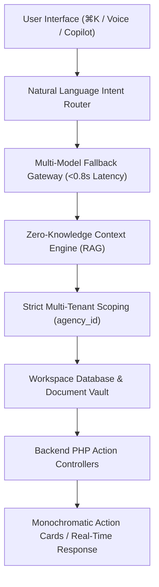

# Cora Platform — RAG Principles & Platform AI Foundation

This document defines the core architecture, security boundaries, retrieval mechanisms, and agentic workflows of the **Cora Zero-Knowledge Context Engine (RAG)** and **Platform AI Foundation**.

---

## 1. Core Architectural Pillars of Cora Platform AI

### 1.1 Truly AI-Native vs. AI-Assisted
In traditional SaaS platforms (e.g. GoHighLevel, standard CRMs), AI operates as an isolated text-completion add-on. In Cora, the Platform AI functions as an **autonomous, agentic operations manager** embedded directly into the workspace runtime.

---

## 2. Five RAG Principles (Zero-Knowledge Context Engine)

### Principle 1: Strict Multi-Tenant Isolation & Zero-Leakage
- **Tenant Isolation**: Every vector chunk, document embed, client communication record, and ledger entry is strictly scoped by `agency_id`.
- **Query Boundary**: AI retrieval queries never execute across tenant boundaries. Vector search indices and relational lookups enforce mandatory SQL `WHERE agency_id = %d` filters.
- **Zero Cross-Contamination**: Cached embeddings and contextual caches are namespace-isolated per tenant.

### Principle 2: Real-Time Situational Awareness Injection
Unlike static LLM prompts, Cora dynamically hydrates the AI runtime with real-time operational context at sub-millisecond speeds:
- **Live Clock & Timezone**: Injects real-world current timestamp in Indian Standard Time (IST) and user locale.
- **Operational Snapshot**:
  - Live CRM lead count, pipeline velocity, and unconverted high-intent leads.
  - Cleared cash in bank, pending receivables, and overdue invoices.
  - Scheduled shoots, site visits, and booking slot availability.
  - Active Document Vault contracts pending e-signature.
  - Open operational tasks and daily agenda items.

### Principle 3: Semantic Blueprint & Variable Auto-Mapping (Vault AI)
- **Unstructured to Structured Conversion**: Cora AI ingests raw unstructured client communications (WhatsApp chats, email threads, form entries, meeting transcripts) and matches them against standard corporate blueprints and contract templates.
- **Dynamic Field Resolution**: Pricing terms, GST calculations (SAC 998361 / SAC 998381), client legal names, property identifiers, and delivery milestones are automatically extracted, validated, and injected into legally binding contracts in the Document Vault.

### Principle 4: High-Availability Multi-Model Fallback Gateway
Cora operates a resilient multi-tier LLM gateway ensuring sub-second (<0.8s) response times with automatic failover:
1. **Tier 1 (High-Speed Reasoning)**: Groq / Qwen 2.5 72B / Gemini 3.5 Flash (Default fast operational agent).
2. **Tier 2 (High-Capacity Synthesis)**: Claude 3.5 Sonnet / OpenAI GPT-4o (Complex legal synthesis, multi-step contract drafting, financial forecasting).
3. **Tier 3 (Local Deterministic Engine)**: Offline regex-based intent classification, structured keyword parsing, and localized transaction math if external gateways are unavailable.

### Principle 5: Action-Oriented Conversational Execution
- **Zero Passive Chat**: Conversations with Cora AI generate structured **Action Cards** rather than plain text descriptions.
- **Executable Payload Drawers**: Asking the AI to log an expense, draft an invoice, or schedule a tour returns an interactive, prefilled slide drawer ready for 1-click confirmation.
- **Direct CRUD Bridge**: Authenticated commands invoke backend AJAX/REST controllers directly (`cora_workspace` endpoints) with dual nonce security (`cora_ajax_nonce` & `wp_rest`).

---

## 3. Privacy, Security & Identity Rules

1. **Zero Use of Owner Name**:
   - Never inject or expose the platform owner's name in any AI prompt template, form placeholder, sample table row, demo signature, or marketing copy.
   - Strictly use generic fictitious identifiers (e.g. `Rohan Verma`, `Kavya Patel`, `Aarav Mehta`, `Studio Admin`, `Studio Director`, `Workspace Owner`).
2. **BYOK Obfuscation**:
   - User-supplied AI API keys (OpenAI, Anthropic, Gemini, Groq, OpenRouter) are stored base64-obfuscated and encrypted in the database, preventing plaintext exposure in client-facing telemetry tables.
3. **No Browser Defaults**:
   - All AI feedback, errors, and progress indicators route through the monochromatic Toast system (`window.coraShowToast`) and bottom slide-up sheets.

---

## 4. Operational Personas Matrix

| Persona | Module Scope | Primary RAG Context | Autonomous Capabilities |
| :--- | :--- | :--- | :--- |
| **Cora Co-Founder** | Dashboard (`/workspace/dashboard`) | Full business telemetry, daily agenda, cash runway, team metrics | Morning executive briefings, bottleneck identification, anomaly alerts |
| **Cora CRO** | Leads & CRM (`/workspace/leads`) | Inbound leads, stage history, WhatsApp chat logs, showing schedules | Speed-to-lead qualification, automated follow-ups, win probability scoring |
| **Cora CFO** | Finance & Ledger (`/workspace/financials`) | Transaction ledger, GST reserves, accounts receivable, recurring costs | Expense logging, GST invoice drafting, cash flow runway forecasting |
| **Cora Counsel** | Document Vault (`/workspace/documents`) | Template library, executed agreements, audit trail, sign registry | Deal term parsing, contract drafting, e-signature dispatch |
| **Cora CMO** | Content & SEO (`/workspace/canvas`) | Keyword ranks, Google Profile metrics, local competitors | Local landing page generation, SEO metadata audit, blog generation |
| **Cora COO** | Operations & Team (`/workspace/team-roles`) | Attendance logs, geofence records, gear inventory, booking calendar | Shift scheduling, proximity assignment, equipment reservation |

---

## 5. Summary
The Cora Platform AI and RAG engine transforms everyday business operations into an autonomous, proactive operational cockpit. By enforcing strict multi-tenant isolation, real-time situational awareness, multi-model speed, and action-oriented execution, Cora provides enterprise-grade reliability and security across all workspace industries.
