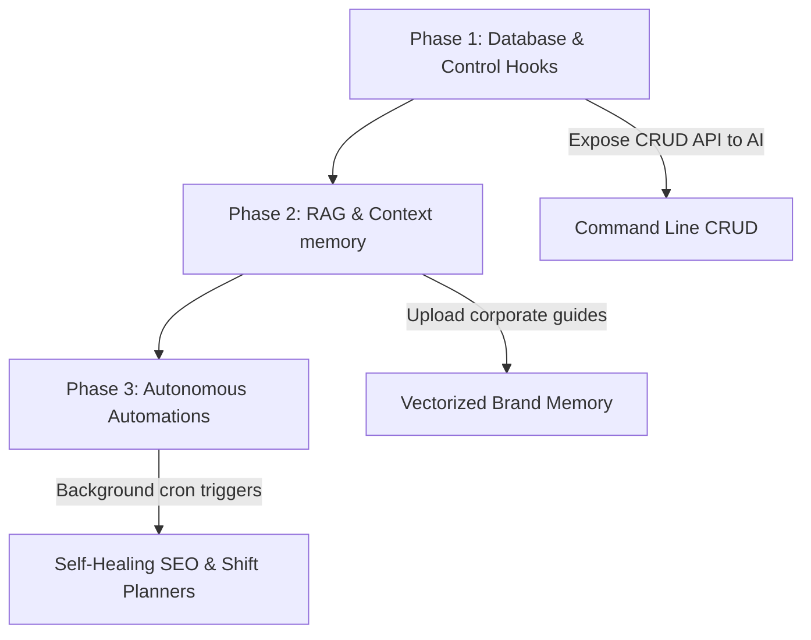

# Cora Workspace Platform - AI-Native Strategy

To gain a competitive edge over established market giants like **GoHighLevel (GHL)** and **Shopify**, Cora must pivot from being a platform that merely has **AI-assisted features** (e.g. text generation boxes) to being a truly **AI-native ecosystem**. 

In existing tools, AI is an add-on. In Cora, the AI should act as an **autonomous, agentic operations manager** that sits directly at the center of the database, operating on behalf of the user.

---

## 1. Competitive Matrix: The AI Landscape

| Feature / Capability | GoHighLevel (GHL) | Shopify | **Cora Platform (AI-Native)** |
| :--- | :--- | :--- | :--- |
| **AI Integration Type** | Bolt-on APIs (Content writing, SMS/Webchat booking bots) | Shopify Magic (Copywriting), Sidekick (Theme/analytics assistant) | **Agentic Hub** (Deep workspace CRUD access, cross-module automation) |
| **Data Scope** | Single-lead CRM tracking | Product inventory & eCommerce logs | **Unified Tenant Context** (CRM + E-Sign Vault + Geofenced Attendance + Theme Builder) |
| **Industry Specialization** | Broad agencies (Rules-heavy) | Online retailers | **Multi-Industry Scopes** (Tailored context for Real Estate, Studios, etc.) |
| **Autonomy Level** | Low (Requires manual setup of complex workflows) | Medium (Toggles settings, writes text on demand) | **High** (Runs background routines, audits metrics, auto-reconciles tasks) |

---

## 2. Five Pillars of Cora's AI-Native Advantage

### Pillar 1: The Conversational Operating System (Actionable Command Bar)
Instead of clicking through 5 different pages to invite users, check analytics, or generate an agreement, the user controls their entire business operations through the command interface or the inline resizable sidebar.
* **How it works**: Deep integrations of the command palette (`⌘K`) and AI sidebar with backend PHP router controllers.
* **Example prompts**:
  - *"Cora, create a photoshoot booking for tomorrow 4 PM for Ananya Sharma, assign it to the photographer with the highest attendance score, and email the invoice."*
  - *Result*: Cora AI checks availability in **Bookings** -> calculates rating in **Attendance Logs** -> generates payment link -> dispatches via SMTP.

### Pillar 2: Agentic Document E-Sign Automation (Vault AI)
While other platforms only store static PDFs, Cora leverages its unified vault.
* **How it works**: Cora parses incoming unstructured client briefs or notes and compares them against corporate blueprint templates.
* **Example prompts**:
  - *"Take these raw property deal terms from the chat history and draft a legally-binding Sales Agreement."*
  - *Result*: The AI parses pricing, buyer info, and tax structures from the CRM logs, replaces variables inside the document template, saves it to the **Vault**, and schedules a secure share link.

### Pillar 3: Organic Local Search Engine Funnel Generator (SEO/GEO Agent)
For local businesses (real estate offices, local photo studios), organic search is their main growth source. GoHighLevel requires high ad budgets.
* **How it works**: An autonomous SEO audit script monitors target keyword ranks weekly. If rank drops, the AI doesn't just alert the owner; it **proposes and writes local-intent landing pages** directly integrated into the Canvas Builder.
* **Example prompts**:
  - *"Optimize our portfolio site to rank for 'professional videographers in Mumbai'."*
  - *Result*: AI generates geo-targeted galleries, schemas, and reviews, updating the frontend page without human design time.

### Pillar 4: Geofence Attendance & Auto-Matching Scheduler
For team-heavy operations, managing shifts and locations is highly inefficient.
* **How it works**: Cross-referencing geofence office addresses, employee proximity records, and project schedules.
* **Example prompts**:
  - *"We have a last-minute property tour in Pune. Who is closest and has checking status?"*
  - *Result*: The AI queries live location coordinates (via mobile geofencing heartbeats) and registers the booking, alerting the team member instantly.

### Pillar 5: Zero-Knowledge Context Engine (RAG)
LLMs write generic, robotic text. Cora holds a secure, tenant-isolated vector memory of all previous listings, custom blueprints, communication history, and brand profiles.
* **How it works**: Every generated proposal, email, and description is highly customized to match the tenant's brand voice, historical transaction math, and regional regulatory terms out-of-the-box.

---

## 3. Implementation Roadmap

### Phase 1: Interactive CRUD Hooking (Quick Wins)
Hook key dashboard buttons to allow the right-side AI sidebar to read and write database rows. Expose simple JSON routers for common actions (add lead, create booking, fetch attendance sheet).

### Phase 2: RAG & Contextual Synthesis
Deploy a local or secured remote vector store for tenant-uploaded materials (company handbook, historical listing descriptions, local pricing sheets). This removes "hallucinations" and gives Cora AI professional domain expertise.

### Phase 3: Autonomous Triggers (True Category Killer)
Enable "Self-Healing Workspaces." The system runs periodic cron checks (e.g. analyzing pipeline bottlenecks, low client review scores, rank drops) and drafts remediation plans for the owner's 1-click approval.
