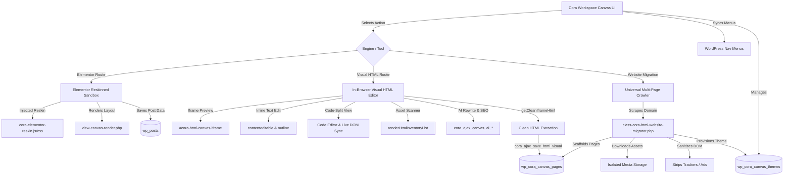

# Cora Platform — Canvas & Frontend Module Documentation (v4.9.118)

## Section 1: Overview & Multi-Engine Architecture

Cora Canvas is a unified frontend website and theme creation engine providing a 100% white-labeled builder experience for agencies and workspace owners. Hardened through **v4.9.118**, Canvas operates across three core architectural engines:

1. **Engine A: Elementor White-Labeled Engine**: Wraps native Elementor in a sandboxed, two-row monochromatic toolbar (`cora-elementor-reskin.js` and `.css`), stripping out all WordPress headers, admin bars, upsell notices, and third-party references.
2. **Engine B: Visual HTML Canvas Engine (Lovable-Compatible)**: In-browser visual HTML editor rendering semantic HTML5/Tailwind inside an isolated sandboxed iframe (`#cora-html-canvas-iframe`) with inline `contenteditable` editing, media inventory scanning, 1-click image swapping, code-split editing, URL edit state persistence, and AI rewriting.
3. **Engine C: Universal Website Multi-Page Migrator Engine**: 1-click ingestion and crawler engine (`class-cora-html-website-migrator.php`) that scrapes external HTML/CSS/JS websites, downloads/isolates assets, sanitizes DOM code, and provisions editable draft themes.

---

### Architecture Diagram



---

## Section 2: Canvas Theme Builder & Lifecycle

The Theme Builder allows agencies to manage multiple design themes per workspace with complete tenant isolation (`agency_id = %d`).

### 2.1 Draft vs. Live Themes
* **Draft Themes**: Staged sandbox where agencies can tweak CSS variables, typography ramps, color schemes, and page templates without impacting public traffic.
* **Live Theme**: The single active theme serving production traffic. Publishing a draft automatically promotes it to `live` and demotes the previous live theme to `draft`.

### 2.2 Add Theme Wizard
The creation wizard provides triple visual cards:
* **Elementor Builder Card**: Provisions Elementor container templates and theme parts.
* **Lovable / Visual HTML Builder Card**: Provisions lightweight, zero-dependency HTML5 templates with instantaneous render speeds.
* **Universal Website Migrator Card**: Ingests external websites directly into draft themes.
* **Wizard Reset Engine**: `window.wizardResetCards()` cleanly resets card active states upon closing or reopening the modal.

---

## Section 3: Universal Website (HTML/CSS/JS) Multi-Page Migrator Engine (v4.9.58 - v4.9.59)

The Universal Website Migrator (`class-cora-html-website-migrator.php`) enables instantaneous website ingestion into Cora Canvas:

```
+-----------------------------------------------------------------------------------+
|                        UNIVERSAL WEBSITE MIGRATION PIPELINE                       |
+-----------------------------------------------------------------------------------+
|  [ 1. URL Ingestion & Domain Guard ]  --->  Validates domain & prevents recursion  |
|  [ 2. Multi-Page DOM Crawler ]        --->  Discovers internal links (< 25 pages) |
|  [ 3. Asset Downloader & Localizer ]  --->  Fetches CSS, JS, Fonts & Images       |
|  [ 4. DOM Cleaner & Security Shield]  --->  Strips trackers, ads, scripts         |
|  [ 5. Draft Theme Scaffolding ]       --->  Creates theme in wp_cora_canvas_themes|
|  [ 6. Visual Canvas Rendering ]       --->  Opens directly in Visual HTML Editor  |
+-----------------------------------------------------------------------------------+
```

### 3.1 Migration Workflow & Sequence
1. **Target Validation**: Workspace owner inputs public URL (e.g. `https://agency-sample.com`), selects scan depth (1-5), and sets maximum page limits.
2. **Recursive Domain Crawling**: The engine extracts all internal hyperlinks matching the root domain host while filtering out anchor fragments, external social links, file downloads (`.pdf`, `.zip`), and JavaScript template strings.
3. **Asset Isolation & Local Bundling**:
   - Downloads linked CSS stylesheets and extracts embedded `@import` and `url()` references.
   - Downloads images (``, `srcset`, inline CSS `background-image`) and places them into isolated workspace upload directories.
   - Rewrites HTML references to localized paths.
4. **HTML Sanitization & Body Preservation**:
   - Preserves complete document structure, CSS variables, and layout classes.
   - Strips malicious scripts, external analytics (Google Analytics, Meta Pixel), tracking iframes, and external advertising widgets.
5. **Draft Theme Creation**: Registers a new theme record in `wp_cora_canvas_themes` (`engine='lovable'`, `status='draft'`) and populates all crawled pages in `wp_cora_canvas_pages`.
6. **Instant Visual Editing**: Directly launches the newly migrated theme in the Visual HTML Editor for immediate text, image, and styling modifications.

### 3.2 Streamlined Monochromatic Migration UI
* Dedicated migration drawer/modal with dark blurred backdrop overlay (`rgba(9,9,11,0.45)`).
* Real-time progress bar and step indicators (*Analyzing Domain* → *Crawling Pages* → *Bundling Assets* → *Generating Canvas Pages*).
* Live terminal-style status readout.

---

## Section 4: In-Browser Visual HTML Editor Engine

The Visual HTML Canvas Engine allows rapid editing of static, AI-generated, and migrated HTML pages directly in the browser:

```
+-----------------------------------------------------------------------------------+
|                           VISUAL HTML CANVAS EDITOR                               |
+------------------------------------+----------------------------------------------+
|       Sidebar Controls             |            Live Iframe Canvas                |
|  • Device Switcher (Mobile/Desktop)|  [ Header: "Modern Creative Studio" ]        |
|  • Media Asset Inventory List      |    (Click to edit text directly inline)      |
|  • Image Swapper Modal Launcher    |  [ Hero Image:  ]        |
|  • AI Element Rewriting Drawer     |    (Hover -> "Swap Image" indicator)         |
|  • Code-Split Mode Toggle          |  [ CTA: "Book Consultation" ]                |
+------------------------------------+----------------------------------------------+
|               Bottom Dock: [ Code Split ]  [ AI Insights ]  [ Save & Publish ]    |
+-----------------------------------------------------------------------------------+
```

### 4.1 Live Iframe Sandboxing
HTML pages load inside an isolated `<iframe>` (`#cora-html-canvas-iframe`) to prevent style collisions between the platform dashboard UI and the client website theme.

### 4.2 Real-Time Inline `contenteditable` Editing
* Clicking any text element (`<h1>`–`<h6>`, `<p>`, `<span>`, `<a>`, `<button>`) inside the iframe enables `contenteditable="true"`.
* Active elements display a subtle monochromatic focus outline (`outline: 2px solid #18181b; outline-offset: 2px`).
* Changes are mirrored in memory immediately.

### 4.3 Code-Split Editor Mode & URL Edit State Persistence
* **Code-Split Mode**: Toggle between purely visual canvas and split-screen HTML source code editor with instant bidirectional live updates.
* **URL State Persistence**: Maintains the active page ID and edit mode in the browser query string (`?page_id={id}&edit_mode=visual`), preventing loss of work across page reloads.

### 4.4 Media Asset Inventory Scanner (`renderHtmlInventoryList`)
* On load, the editor parses all `` tags inside the iframe DOM.
* Generates an interactive thumbnail gallery in the left sidebar showing image dimensions, aspect ratios, and current `src` attributes.

### 4.5 1-Click Image Replacement Modal (`openImageReplacerPopover`)
* Clicking any image in the iframe or sidebar inventory opens `#cora-image-replacer-popover`.
* Allows picking images from the **Cora Media Library** or specifying an external URL.
* Instantly updates the iframe DOM node in real-time.

### 4.6 Clean HTML Extraction Engine (`getCleanIframeHtml`)
To prevent editor state tags from leaking into production:
1. Clones the iframe document DOM.
2. Strips all `contenteditable` attributes.
3. Removes `.cora-editing-active`, temporary highlight wrappers, and editor instrumentation classes.
4. Returns clean, valid, production-ready HTML5 markup.

### 4.7 Canvas Route Isolation Engine
* Ensures public Canvas theme frontend routes (`/page/{slug}`, `/theme-preview`) operate in complete isolation from internal workspace subview routes (`/workspace/{subpage}`).

---

## Section 5: AI-Powered Canvas Tools

### 5.1 AI Element Rewriter (`cora_ajax_canvas_ai_rewrite_element`)
* Re-drafts selected headlines, subtext, and call-to-actions.
* Supports 4 contextual tones:
  - *Punchy & Direct*
  - *Professional & Trustworthy*
  - *High-Converting / Sales-Focused*
  - *Minimalist & Modern*

### 5.2 Automated Core Web Vitals & SEO Optimizer (`cora_ajax_canvas_ai_optimize_page`)
* Evaluates page markup against Google Core Web Vitals standards:
  - **LCP (Largest Contentful Paint)**: Injects `fetchpriority="high"` and preloads above-the-fold hero images.
  - **CLS (Cumulative Layout Shift)**: Ensures explicit `width` and `height` attributes on all images.
  - **FID / INP**: Optimizes inline script loading with `defer`.
  - **SEO**: Scans and optimizes OpenGraph meta tags, canonical links, and structured JSON-LD data.

---

## Section 6: Elementor White-Labeling Engine

For complex visual layouts, Elementor is wrapped in a dedicated white-label skin:
* Injects `cora-elementor-reskin.js` and `cora-elementor-reskin.css`.
* Suppresses default WordPress admin bars, logos, help popovers, and promotional up-sell banners.
* Injects a dual-row monochromatic top bar with Workspace navigation, Draft/Live status toggles, device preview switchers, and Git commit actions.

---

## Section 7: Database Schema

### 7.1 Themes Table (`wp_cora_canvas_themes`)
```sql
CREATE TABLE wp_cora_canvas_themes (
    id bigint(20) unsigned NOT NULL AUTO_INCREMENT,
    agency_id bigint(20) unsigned NOT NULL,
    name varchar(255) NOT NULL,
    engine varchar(50) NOT NULL DEFAULT 'lovable', -- 'lovable' | 'elementor'
    status varchar(50) NOT NULL DEFAULT 'draft',   -- 'draft' | 'live'
    settings longtext DEFAULT NULL,                -- JSON: fonts, colors, CSS, header_id, footer_id
    created_at datetime DEFAULT CURRENT_TIMESTAMP,
    updated_at datetime DEFAULT CURRENT_TIMESTAMP,
    PRIMARY KEY (id),
    KEY agency_id (agency_id)
);
```

### 7.2 Pages Table (`wp_cora_canvas_pages`)
```sql
CREATE TABLE wp_cora_canvas_pages (
    id bigint(20) unsigned NOT NULL AUTO_INCREMENT,
    agency_id bigint(20) unsigned NOT NULL,
    theme_id bigint(20) unsigned NOT NULL,
    wp_post_id bigint(20) unsigned DEFAULT NULL,
    title varchar(255) NOT NULL,
    slug varchar(255) NOT NULL,
    template varchar(50) NOT NULL DEFAULT 'standard',
    html_content longtext DEFAULT NULL,            -- Visual HTML Engine content
    is_homepage tinyint(1) NOT NULL DEFAULT 0,
    seo_title varchar(255) DEFAULT NULL,
    seo_description text DEFAULT NULL,
    seo_og_image varchar(255) DEFAULT NULL,
    created_at datetime DEFAULT CURRENT_TIMESTAMP,
    updated_at datetime DEFAULT CURRENT_TIMESTAMP,
    PRIMARY KEY (id),
    KEY agency_id (agency_id),
    KEY theme_id (theme_id)
);
```

---

## Section 8: AJAX API Reference

| Action | Endpoint / Hook | Parameters | Description |
| :--- | :--- | :--- | :--- |
| **Migrate Website** | `cora_ajax_canvas_migrate_website` | `target_url`, `crawl_depth`, `max_pages`, `nonce` | Ingests external site, localizes assets, and provisions draft theme. |
| **Migration Status** | `cora_ajax_canvas_get_migration_status`| `job_id`, `nonce` | Returns real-time crawler progress and page count. |
| **Delete Theme** | `cora_ajax_canvas_delete_theme` | `theme_id`, `nonce` | Securely removes draft theme and associated canvas pages. |
| **Create Theme** | `cora_ajax_create_canvas_theme` | `name`, `engine`, `nonce` | Provisions a new theme in `draft` status. |
| **Publish Theme** | `cora_ajax_publish_canvas_theme` | `theme_id`, `nonce` | Sets theme to `live` and demotes prior live theme. |
| **Save Theme Settings**| `cora_ajax_save_canvas_settings` | `theme_id`, `settings_json`, `nonce` | Saves typography, colors, global CSS. |
| **Create Page** | `cora_ajax_create_canvas_page` | `theme_id`, `title`, `slug`, `template` | Provisions Canvas page and mapped `wp_posts` entry. |
| **Save Visual HTML** | `cora_ajax_save_html_visual` | `page_id`, `html_content`, `nonce` | Extracts clean HTML and commits to database. |
| **Get HTML Page Data**| `cora_ajax_get_html_page_data` | `page_id`, `nonce` | Returns raw HTML and SEO metadata for editor. |
| **AI Element Rewrite**| `cora_ajax_canvas_ai_rewrite_element`| `element_text`, `tone`, `prompt` | Returns AI rewritten copy variants. |
| **AI SEO / CWV Optimize**| `cora_ajax_canvas_ai_optimize_page`| `page_id`, `html_content` | Performs automated Core Web Vitals optimizations. |
| **Create Nav Menu** | `cora_ajax_create_nav_menu` | `menu_name`, `items_json`, `nonce` | Synchronizes menu with WordPress `nav_menu`. |

---

*Cora Canvas Documentation v4.9.118 — Last updated: September 2026.*
