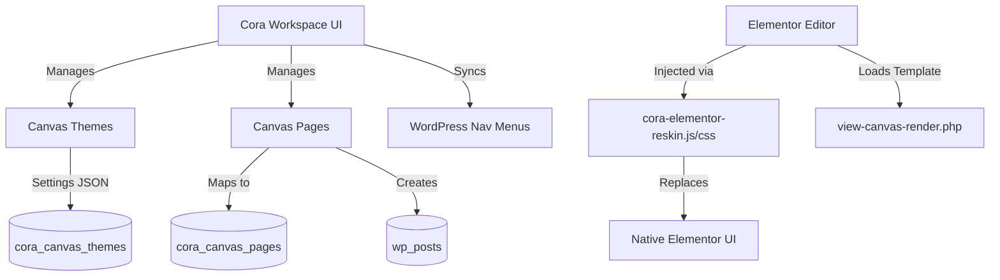

# Cora Platform — Canvas & Frontend Module Documentation

## Section 1: Overview

Cora Canvas is a comprehensive frontend and theme builder module that tightly integrates with WordPress and Elementor. Its primary goal is to provide a complete white-labeled website builder experience for agency administrators and workspace owners. By wrapping Elementor in a custom, controlled interface, Cora Canvas isolates the user from standard WordPress admin screens, offering a streamlined, branded, and intuitive environment for building and managing websites.

### Key Capabilities
- **Theme Builder**: Manage complete design systems (Draft vs Live themes).
- **Page Management**: Integrated page mapping to WordPress posts with specific Canvas templates (Header, Footer, Single, Archive, 404).
- **Menu Management**: Bidirectional sync with WordPress native menus.
- **Elementor White-labeling**: A custom reskinned toolbar overriding Elementor's native top bar and stripping out WordPress references.
- **Git Integration**: Direct connection to GitHub for version control and environment syncing.

### Architecture Diagram

## Section 2: Canvas Theme Builder

The Theme Builder is the core of the Canvas module, allowing agencies to create and manage multiple themes per workspace.

### Draft vs. Live Status
Themes in Canvas can either be **Draft** or **Live**. 
- **Draft Themes**: Allow users to make global design changes (CSS, typography, colors) and build pages without affecting the live website.
- **Live Theme**: The active theme currently serving traffic. Only one theme can be live at any given time.

### Theme Settings
Theme settings are centralized and saved as a structured JSON object in the database. These settings include:
- **Global CSS**: Custom CSS injected globally into the frontend.
- **Typography**: Base fonts, heading styles, and responsive sizing.
- **Color Palette**: Primary, secondary, text, and background color definitions utilized throughout Elementor.
- **Header & Footer Assignments**: Which specific Canvas header/footer templates to apply to the site layout.

### Publishing Workflow
When a draft theme is published, the system:
1. Updates the theme's status to `live`.
2. Changes the previously live theme to `draft`.
3. Reassigns or publishes all associated `cora_canvas_pages` and their mapped WordPress posts to reflect the new active site architecture.
4. Triggers an environment cache clear to reflect changes immediately.

## Section 3: Pages Management

Pages in Canvas act as a structural layer on top of native WordPress posts. They abstract away the complexity of WordPress post types.

### Page Types
When creating a page in Canvas, users can select from various functional types:
- **Standard**: Standard web pages (Home, About, Contact).
- **Header**: Global header templates.
- **Footer**: Global footer templates.
- **Single**: Templates for single post views (e.g., Blog Post).
- **Archive**: Templates for category or taxonomy listings.
- **Error-404**: Custom 404 Not Found pages.

### Mapping to WordPress
Every Canvas page corresponds to a WordPress post. When a page is created in Canvas, a corresponding record is created in `wp_posts`, and the `wp_post_id` is stored in the `cora_canvas_pages` table. This allows Elementor to render the standard WordPress post while Canvas controls the metadata, SEO, and visibility.

### SEO & Slugs
Pages manage their own SEO settings directly within Canvas:
- `seo_title`
- `seo_description`
- `seo_og_image`
- `slug` (which syncs directly to the WordPress post `post_name`)

## Section 4: Menus Management

Menu management in Canvas offers a clean interface for building site navigation, which bidirectionally syncs with WordPress's native `nav_menu` taxonomy.

### Synchronization
When a menu is created in Canvas via the `cora_ajax_create_nav_menu` AJAX action, it generates a WordPress taxonomy term under `nav_menu`. Deleting it via `cora_ajax_delete_nav_menu` removes the term.

### Menu Items
Users can define:
- **Labels**: The display text.
- **URLs**: Custom links or internal page routes.
- **New Tab**: Whether the link opens in `target="_blank"`.
- **Nesting**: Parent-child relationships for dropdown menus.

These menus are seamlessly consumable by the **Elementor Nav Menu widget**, ensuring zero friction when designing headers.

## Section 5: The Elementor Editor Integration

Canvas completely transforms the Elementor editing experience by injecting a custom two-row toolbar (`cora-elementor-reskin.js` and `.css`) that overwrites the default Elementor UI.

### Custom Cora Toolbar
The custom toolbar is injected directly into the DOM (outside of Elementor's wrapper) and forces the native top bar to be hidden.

**Toolbar Row 1 (Navigation & Status):**
- **Logo**: Cora branded icon.
- **Back Button**: "Theme Dashboard" button redirecting back to the Workspace Canvas UI.
- **Breadcrumbs**: Shows context, e.g., `Theme Builder / [Page Title] / [PAGE TYPE BADGE]`.
- **Save Status**: Dynamic indicator (dot and text) showing "Saving...", "All changes saved", or "Draft Theme".
- **Preview**: Button to trigger the frontend preview in a new tab.

**Toolbar Row 2 (Tools & Publishing):**
- **Templates**: Opens the Elementor template library.
- **Git**: Toggles the custom Git drawer for commits.
- **Settings**: Opens the page/theme settings panel.
- **Undo / Redo**: Quick access history controls.
- **Device Switcher**: Toggles between Desktop, Tablet, and Mobile preview breakpoints.
- **Navigator**: Toggles the Elementor structural navigator.
- **Publish Menu**: A split button allowing users to explicitly "Save Draft" or "Publish".

### White-labeling Modifications
To ensure a fully branded experience, the reskin scripts forcefully remove:
- All "Exit to WordPress" links.
- Elementor Pro upsells and promotion banners ("Go Pro", "Try for free").
- AI features ("Edit with AI", "Angie").
- Checklists and "What's New" tooltips.
- The default top bar is forced to 0px height using CSS variables (`--editor-v2-top-bar-height: 0px`).
Browser native alerts, confirms, and prompts are also intercepted and replaced with custom toast notifications.

## Section 6: Theme Settings Panel

The Theme Settings panel (accessible via the toolbar Settings button) allows workspace owners to configure site-wide variables.
- **Global CSS Editor**: A CodeMirror-powered interface for writing custom CSS injected into `view-canvas-render.php`.
- **Typography & Colors**: Directly bind to Elementor's Global Fonts and Global Colors system.
- **Layout Assignments**: Select which Header and Footer templates apply to the site.
These settings are serialized to JSON and stored in the `settings` column of `cora_canvas_themes`.

## Section 7: Git Integration

Canvas includes an advanced Git integration system enabling infrastructure-as-code for frontend assets.

- **Connection**: Workspace owners can link a specific GitHub repository.
- **Sync Settings**: Define the active branch and bind it to a specific Live URL (e.g., staging vs. production).
- **Push Workflow**: Directly from the custom Elementor toolbar, users can open the Git drawer, review changes, and push commits. This facilitates a true deployment pipeline straight from the visual editor.

## Section 8: AJAX API Reference

The Canvas module relies on secure AJAX endpoints to handle data mutation.

| Action Name | Parameters | Description |
|-------------|------------|-------------|
| `cora_ajax_save_theme_settings` / `cora_ajax_canvas_save_theme_settings` | `nonce`, `theme_id`, `settings` (JSON) | Safely merges and updates the JSON settings column for a specific theme. |
| `cora_create_nav_menu` | `nonce`, `menu_name` | Creates a new WordPress `nav_menu` taxonomy term. |
| `cora_delete_nav_menu` | `nonce`, `menu_id` | Permanently deletes a WordPress menu via `wp_delete_nav_menu`. |
| `cora_ajax_get_preview_url` | `nonce`, `post_id` | Fetches the frontend preview URL for a given Elementor post. |
| `cora_ajax_canvas_save_site_identity` | `nonce`, `theme_id`, `site_title`, `tagline`, `favicon_url` | Synchronizes theme site title, tagline, and favicon to WordPress options. |

## Section 9: Database Schema

Canvas leverages custom database tables to maintain agency isolation and rapid querying.

### `cora_canvas_themes`
| Column | Type | Description |
|--------|------|-------------|
| `id` | bigint(20) | Primary Key, Auto Increment |
| `agency_id` | bigint(20) | Foreign Key mapping to the agency |
| `name` | varchar(255) | Display name of the theme |
| `status` | varchar(20) | `draft` or `live` |
| `settings` | longtext | JSON object of global styles/settings |
| `activated_at` | datetime | Timestamp of when it went live |
| `created_by` | bigint(20) | User ID who created it |
| `created_at` | datetime | Creation timestamp |
| `updated_at` | datetime | Last modification timestamp |

### `cora_canvas_pages`
| Column | Type | Description |
|--------|------|-------------|
| `id` | bigint(20) | Primary Key, Auto Increment |
| `agency_id` | bigint(20) | Agency isolation identifier |
| `theme_id` | bigint(20) | Maps page to a specific theme |
| `wp_post_id` | bigint(20) | Maps to WordPress `wp_posts.ID` |
| `title` | varchar(255) | Page Title |
| `slug` | varchar(255) | URL slug |
| `status` | varchar(20) | Page status (draft/published) |
| `is_homepage` | tinyint(1) | Boolean indicating front page |
| `template` | varchar(100) | Type (header, footer, single, etc.) |
| `seo_title` | varchar(255) | Custom SEO Title |
| `seo_description` | text | Custom SEO Meta Description |
| `seo_og_image` | varchar(500) | Open Graph Image URL |

## Section 10: Access Control & Roles

Security and multi-tenancy are built into the Canvas architecture:

- **Agency Isolation**: All queries against custom tables filter by `agency_id` to ensure tenants cannot access each other's data.
- **cora_branch_manager Role**: This specific user role has restricted read-only access. When handling write operations (such as saving themes or deleting pages), the backend explicitly verifies role membership and prevents mutation. Branch managers can view themes and pages but cannot publish changes or alter global settings.
- **Admin/Manager Roles**: Full access is granted to `administrator`, `cora_manager`, `cora_workspace_owner`, `cora_studio_owner`, and `cora_re_broker_owner` roles.
- **Dynamic Capability Grants**: Workspace admins are dynamically granted `manage_options` for Elementor site editor requests to enable full editor functionality within the white-labeled sandbox.

## Section 11: Recent Canvas Improvements (v3.2.53 → v3.4.0)

### 11.1 Elementor Iframe Fixes
* **Race Condition Resolution (v3.2.55)**: Extended iframe loading timeout limits to prevent blank editor states during slow network conditions.
* **WordPress Admin Bar Suppression**: `#wpadminbar` is hidden inside editor preview iframes, and the `admin-bar` body margin is reset to 0px to prevent content offset gaps.
* **Body Padding Override**: Theme body `padding-top` is overridden to prevent content offset gaps in the preview render.

### 11.2 Template & Routing Improvements
* **Elementor Library Preview**: `view-canvas-render.php` template is now served for `elementor_library` post type previews, preventing routing conflicts.
* **Post Type Interception Guard**: The frontend router no longer intercepts `elementor_library` post types, resolving preview rendering issues.
* **Homepage Routing Fallback**: Fixed conflict when the default WordPress queried object ID is populated, ensuring clean workspace-specific URLs.

### 11.3 Site Identity Synchronization
When theme settings are saved via the Canvas UI, the site title, tagline, and favicon URL are synchronized to WordPress core options (`blogname`, `blogdescription`, `site_icon`), ensuring consistency across Elementor widgets and WordPress templates.

### 11.4 White-Label Enforcement
* **Launch Direct Editor Button Hidden**: The "Edit with Elementor" button is hidden via CSS to enforce the white-labeled iframe sandbox experience.
* **Clean Workspace URLs**: Root routing is restricted to preview states only, preventing leakage of standard WordPress admin URLs.

---
*This documentation reflects Cora Canvas module changes through v3.4.0. Last updated: August 13, 2026.*

